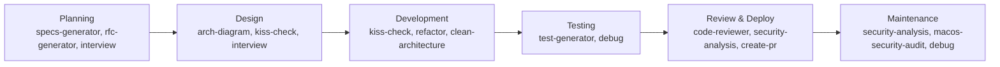

# My Agent Config

A collection of Claude Code skills I use for work.

## Skills

| Skill | Description |
|-------|-------------|
| [arch-diagram](skills/arch-diagram/SKILL.md) | Generates Mermaid.js architecture diagrams. Keeps visual docs in sync with code. |
| [clean-architecture](skills/clean-architecture/SKILL.md) | Guides development using Clean Architecture principles and separation of concerns. Background skill, not directly invoked. |
| [code-reviewer](skills/code-reviewer/SKILL.md) | Comprehensive code review covering quality, security, and maintainability. |
| [create-pr](skills/create-pr/SKILL.md) | Creates pull requests with auto-generated title and description. |
| [debug](skills/debug/SKILL.md) | Test-first debugging. Creates reproducing tests, then uses subagents to implement fixes. |
| [extract-skill](skills/extract-skill/SKILL.md) | Extracts knowledge from web pages or files to create reusable skills. |
| [interview](skills/interview/SKILL.md) | Asks non-obvious technical questions about implementation plans, tradeoffs, and constraints. |
| [kiss-check](skills/kiss-check/SKILL.md) | Forces justification for complex solutions. Must explain why simpler won't work. |
| [macos-security-audit](skills/macos-security-audit/SKILL.md) | Runs a comprehensive security audit on macOS: processes, network, persistence, hardening, and more. |
| [refactor](skills/refactor/SKILL.md) | Safe refactoring with automated test verification after each step. |
| [rfc-generator](skills/rfc-generator/SKILL.md) | Creates RFC documents for new features through interactive questioning. |
| [security-analysis](skills/security-analysis/SKILL.md) | Identifies security vulnerabilities and analyzes security reports. |
| [specs-generator](skills/specs-generator/SKILL.md) | Creates SPECS.md files for new features and design documentation. |
| [test-generator](skills/test-generator/SKILL.md) | Generates unit and integration tests following existing patterns. |

## Skills in the SDLC

- **Planning** -- `specs-generator` for feature specs, `interview` to validate plans
- **Design** -- `arch-diagram` to visualize the system, `kiss-check` to challenge complexity
- **Development** -- `refactor` for safe simplification, `clean-architecture` for structural guidance
- **Testing** -- `test-generator` + `debug` for comprehensive test coverage
- **Review** -- `code-reviewer` and `security-analysis` before merging
- **Maintenance** -- `macos-security-audit` for system hardening, `debug` for bug resolution
